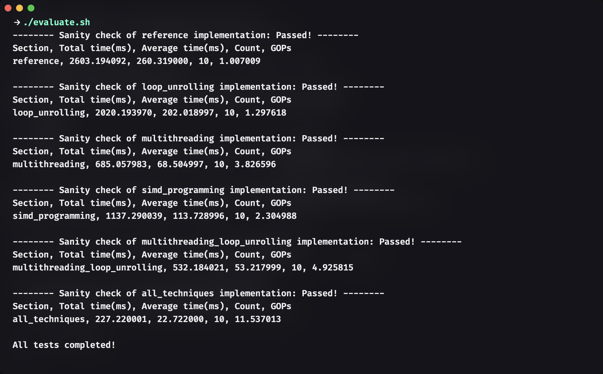

# TinyChat: Optimizing LLM on Edge Devices

This is a lab for [efficientml.ai course](https://efficientml.ai/).

**My Implementation BenchMark**

## Related Projects

[TinyChatEngine](https://github.com/mit-han-lab/TinyChatEngine).

[TinyEngine](https://github.com/mit-han-lab/tinyengine).

[Smoothquant](https://github.com/mit-han-lab/smoothquant).

[AWQ: Activation-aware Weight Quantization for LLM Compression and Acceleration](https://github.com/mit-han-lab/llm-awq)

## Acknowledgement

[llama.cpp](https://github.com/ggerganov/llama.cpp)

[transformers](https://github.com/huggingface/transformers)
